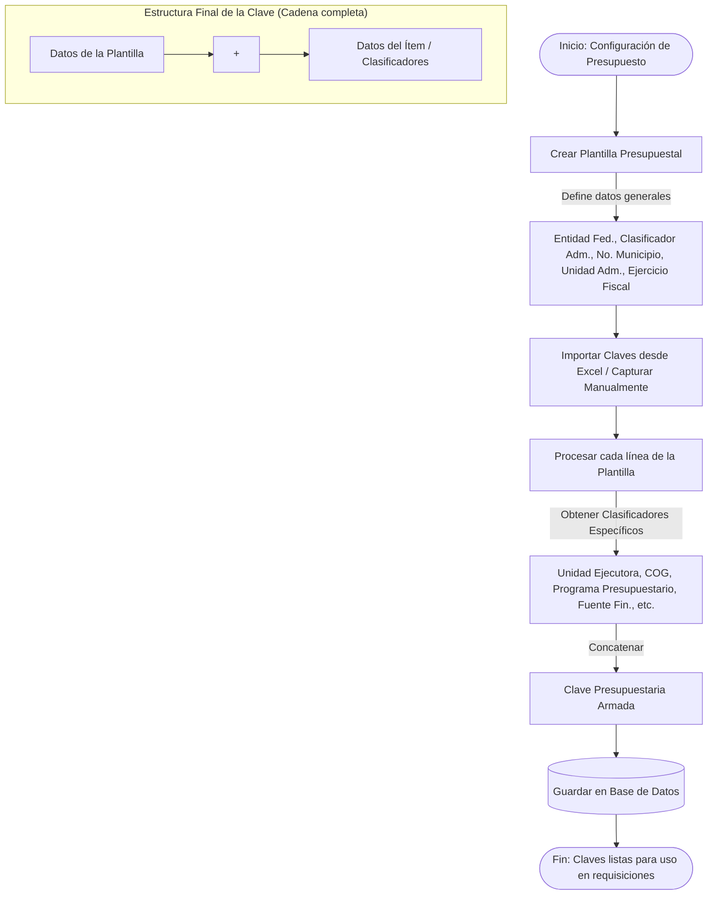

# Armado de la Clave Presupuestaria

Esta sección describe cómo se genera la **Clave Presupuestaria** combinando los datos generales de la organización (definidos en la *Plantilla Presupuestal*) con los clasificadores específicos de cada partida (definidos en cada ítem o línea del Excel).

**Explicación del armado:**

- **Plantilla Presupuestal:** El administrador crea una plantilla por año, definiendo campos estáticos (Ejercicio Fiscal, Entidad Federativa, Unidad Administrativa, etc.).
- **Ítems / Claves (Importación):** Se cargan los clasificadores específicos (COG, Fuente de financiamiento, Acción, etc.) normalmente a través de un archivo de Excel.
- **Clave Armada:** El sistema toma los prefijos de la plantilla y los concatena con los valores del ítem para generar la clave presupuestaria completa que se asignará al presupuesto.
